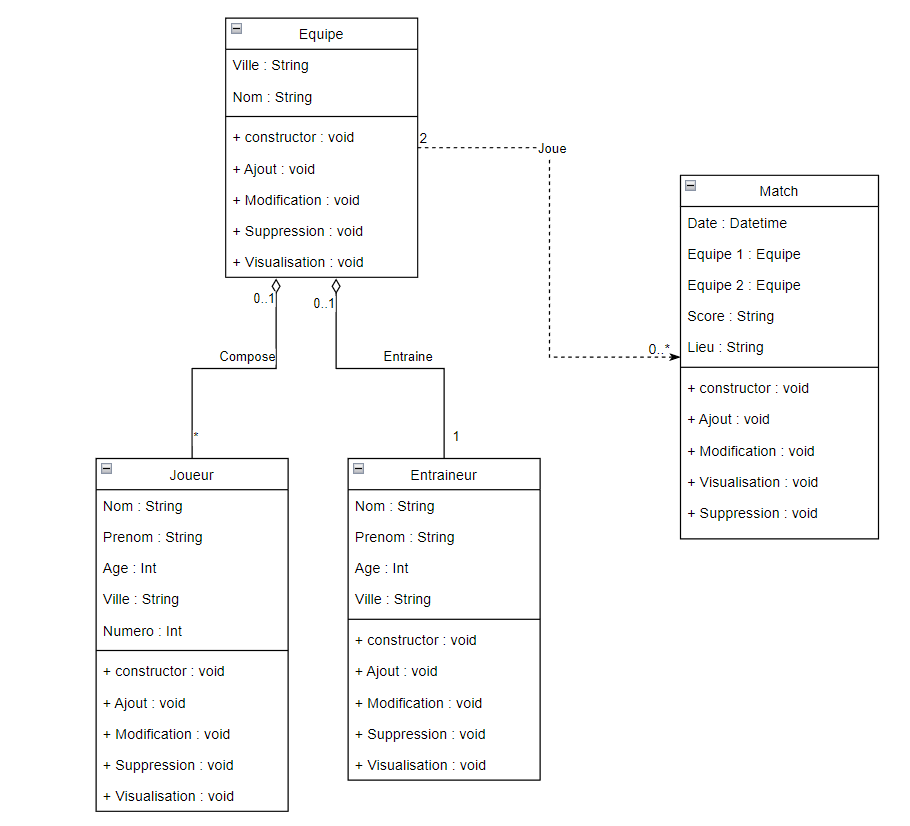

# FastAPI - Sports API

## Introduction
Ce projet est une API FastAPI pour gérer des matchs de sports, des équipes, des joueurs et des coachs. L'API permet de créer, lire, mettre à jour et supprimer des matchs ainsi que de gérer les équipes.

## Architecture des fichiers
```
├──app/
│  │
│  ├── database.py
│  ├── main.py
│  ├── models.py
│  └── schemas.py
│
├──diagrammes/
│  │
│  ├── cas_utilisation.png
│  └── class.png
│
├──README.md
├──index.html
```

### `database.py`
Contient la configuration de la base de données avec SQLAlchemy.

### `main.py`
Point d'entrée de l'application FastAPI, définissant les routes et démarrant le serveur.

### `models.py`
Définit les modèles de données SQLAlchemy pour `Match`, `Team`, `Player` et `Coach`.

### `schemas.py`
Définit les schémas Pydantic pour la validation et la sérialisation des données.

## Diagramme de Cas d'Utilisation


## Diagramme de Classe



## Routes Disponibles

### Matchs
- **GET** `/matchs`
    - Description : Récupérer la totalité des matchs.

- **GET** `/matchs/{id}`
    - Description : Récupérer les informations d'un match spécifique.

- **POST** `/matchs`
    - Description : Ajouter un nouveau match.
    - Exemple de données :
      ```json
      {
          "date": "2024-12-24",
          "equipe_un_id": 2,
          "equipe_deux_id": 1,
          "resultat": "3/5",
          "lieu": "Paris"
      }
      ```

- **PUT** `/matchs/{id}`
    - Description : Mettre à jour un match existant.

- **DELETE** `/matchs/{id}`
    - Description : Supprimer un match.

### Teams
- **GET** `/teams`
    - Description : Récupérer la totalité des équipes.

- **GET** `/teams/{id}`
    - Description : Récupérer les informations d'une équipe spécifique.

- **POST** `/teams`
    - Description : Ajouter une nouvelle équipe.
    - Exemple de données :
      ```json
      {
          "nom": "Equipe de fou",
          "ville": "Ville de fou"
      }
      ```

- **PUT** `/teams/{id}`
    - Description : Mettre à jour une équipe existante.

- **DELETE** `/teams/{id}`
    - Description : Supprimer une équipe.

## CI/CD

Nous utilisons GitHub Actions pour automatiser notre processus de déploiement continu (CI/CD) sur deux environnements : développement (dev) et production (master).

### Configuration des déclencheurs CI/CD

Nous avons configuré nos workflows CI/CD pour être déclenchés sur les branches `dev` et `master`. Voici un aperçu de la configuration :

```yaml
name: CI/CD

on:
  push:
    branches:
      - dev
      - master
```
## Déploiement sur l'environnement de développement (dev)

Lorsque du code est poussé sur la branche dev, GitHub Actions exécute le workflow deploy_dev, qui synchronise le code avec le serveur de développement et démarre l'application via uvicorn.

### Déploiement sur le serveur de développement

Nous utilisons l'action burnett01/rsync-deployments pour synchroniser le code avec le serveur de développement. Les étapes du workflow sont les suivantes :

1. **Checkout du code** : Récupère le code depuis le référentiel GitHub.
2. **Rsync vers le serveur de développement** : Utilise rsync pour synchroniser le code avec le serveur de développement.
3. **Démarrage de l'application** : Lance l'application FastAPI via uvicorn sur le serveur de développement.

## Déploiement sur l'environnement de production (master)

Lorsque du code est poussé sur la branche master, GitHub Actions exécute le workflow deploy_prod, qui synchronise le code avec le serveur de production et démarre l'application via uvicorn.

### Déploiement sur le serveur de production

Nous utilisons également l'action burnett01/rsync-deployments pour synchroniser le code avec le serveur de production. Les étapes du workflow sont similaires à celles du déploiement sur le serveur de développement.

## Configuration des clés SSH

Sur les serveurs de développement et de production, nous avons généré une paire de clés SSH. Nous avons ajouté la clé publique dans le fichier ~/.ssh/authorized_keys pour autoriser l'accès sans mot de passe depuis GitHub Actions.

Nous avons également ajouté la clé privée correspondante comme secret dans les paramètres de notre référentiel GitHub. Ces secrets sont utilisés dans nos workflows CI/CD pour se connecter aux serveurs distants via SSH de manière sécurisée.
